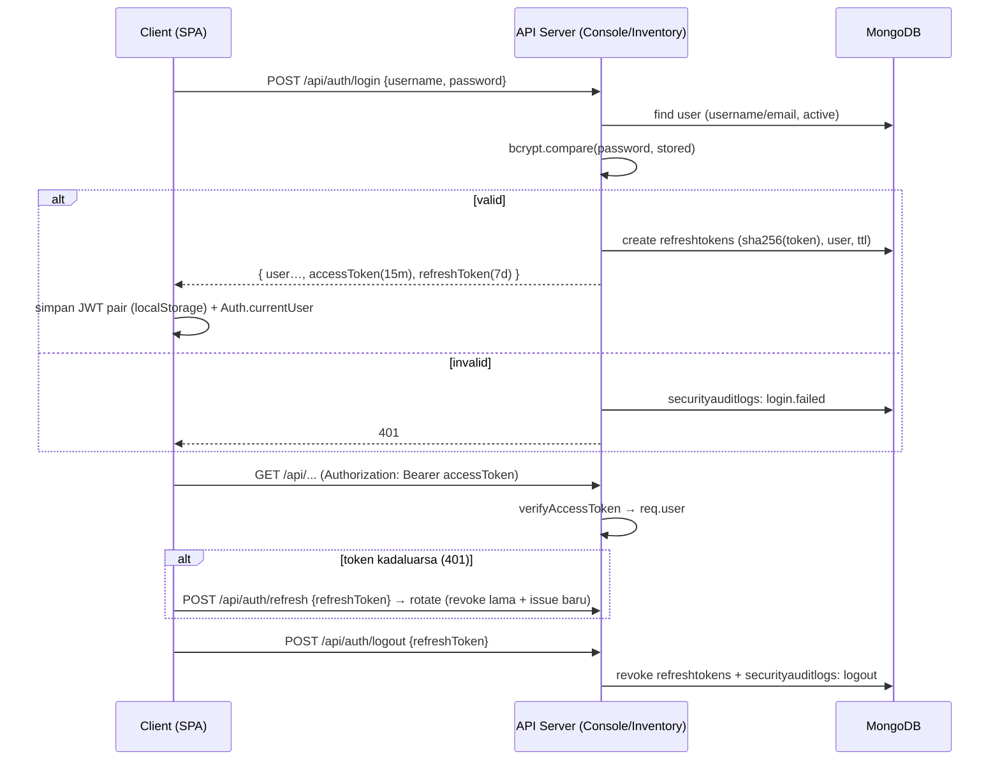
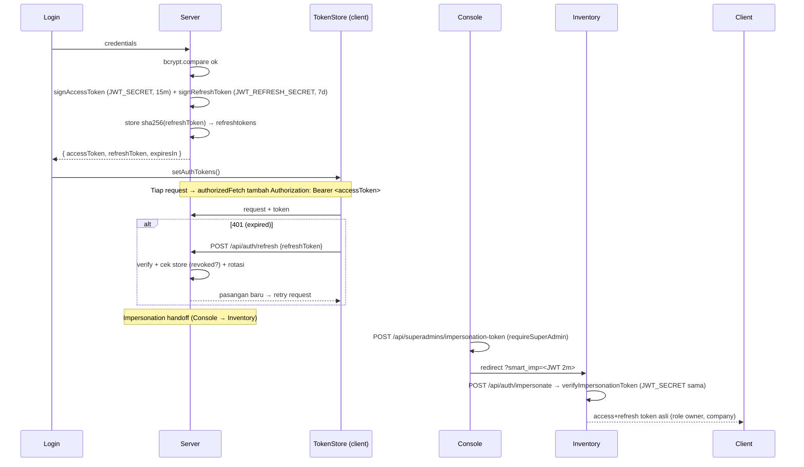

# SP-027 — MILESTONE 3: SMART SECURITY FOUNDATION

> Mode: Architecture & Security Implementation
> Tanggal: 2026-08-08
> Branch: `epic-002-inventory`
> Executor: Freebuff (AI Agent)

---

## 1. Ringkasan Eksekutif

Milestone 3 menutup **seluruh temuan CRITICAL dan HIGH** dari Audit Milestone 0:

| Temuan | Severity | Status M3 |
|---|---|---|
| Password plaintext di database | CRITICAL | ✅ Migrasi otomatis ke bcrypt di boot server |
| Password dibandingkan langsung | CRITICAL | ✅ `bcrypt.compare()` di semua login |
| Seed kredensial hardcoded (`admin123`, `superadmin123`) | CRITICAL | ✅ Dihapus → ENV / random (bootstrap), selalu di-hash |
| Tidak ada JWT / Session | HIGH | ✅ JWT access + refresh token, TTL, verifikasi, rotasi, revoke |
| RBAC hanya di client | HIGH | ✅ `permission()` middleware server-side + resolver role |
| API tanpa middleware otorisasi | HIGH | ✅ `authenticate()` global + whitelist publik |

**Hasil validasi:** ✅ Test 561/561 · ✅ Build Console & Inventory · ✅ Smoke test end-to-end 37/37 · ✅ Zero regression (business logic & UI tidak diubah) · ✅ **Deploy produksi selesai** (PM2 restart, migrasi 11 akun berjalan di produksi).

---

## 2. Arsitektur Keamanan

```
┌───────────────────────────────┐        ┌───────────────────────────────┐
│  SMART Console (SPA)          │        │  SMART Inventory (SPA)        │
│  master.e-profit.id           │        │  inv.e-profit.id              │
│  - @smart/api token-store     │        │  - @smart/api token-store     │
│  - localStorage JWT pair      │        │  - localStorage JWT pair      │
└──────────────┬────────────────┘        └──────────────┬────────────────┘
               │ HTTPS (nginx)                          │ HTTPS (nginx)
┌──────────────▼────────────────┐        ┌──────────────▼────────────────┐
│ Console API (3002)            │        │ Inventory API (3001)          │
│ helmet · cors(env) · ratelimit│        │ helmet · cors(env) · ratelimit│
│ authenticate() + requireSA()  │        │ authenticate() + companyScope │
│ bcrypt · JWT · audit · seed   │        │ bcrypt · JWT · permission()   │
└──────────────┬────────────────┘        └──────────────┬────────────────┘
               │  shared @smart/security                  │
               │  packages/smart-security (bcryptjs,     │
               │  jsonwebtoken, helmet, express-rate-limit)
┌──────────────▼─────────────────────────────────────────▼────────────────┐
│ MongoDB — smart_inventory (schema existing TIDAK berubah)               │
│ + refreshtokens (baru) · securityauditlogs (baru)                       │
└──────────────────────────────────────────────────────────────────────────┘
```

**Komponen shared** — `packages/smart-security/` (server-only, ESM, import relative oleh kedua server):

| File | Tanggung jawab |
|---|---|
| `src/password.js` | bcrypt hash/verify, deteksi plaintext, migrasi idempotent |
| `src/tokens.js` | JWT access/refresh/impersonation, sha256, TTL parse |
| `src/middleware.js` | `authenticate`, `requireSuperAdmin`, `permission`, `methodPermissions`, `resourcePermissions`, `companyScope`, `issueTokens`, `refreshHandler`, `logoutHandler` |
| `src/config.js` | Env-driven config (`JWT_SECRET`, `BCRYPT_ROUND`, …) + secret ephemeral fallback (dev) |
| `src/rate-limit.js` | `createAuthRateLimiter`, `createApiRateLimiter` |
| `src/http.js` | `securityHeaders()` (helmet, CSP off untuk SPA), `corsOriginsFromEnv()` |
| `src/validation.js` | sanitasi & validasi input |
| `src/audit.js` | `createAuditLogger(model)` + convenience (login, failedLogin, passwordChange, roleChange, companySwitch, superadminActivity) |
| `src/migrate.js` | `migratePlaintextPasswords()` — plaintext → bcrypt tiap boot |
| `src/google-verify.js` | `verifyGoogleCredential()` — verifikasi access token Google di server (unit-testable, fetchImpl injectable) |
| `src/cookies.js` | `parseCookies` / `buildCookie` / `clearCookie` — refresh token httpOnly cookie |

---

## 3. Authentication Flow Diagram



**Session management:** login → logout · refresh (rotasi) · token revocation. Sesi tidak lagi hanya state browser — setiap request privat diverifikasi token di server, dan refresh token dapat dicabut kapan pun.

---

## 4. Authorization Flow Diagram

```mermaid
flowchart TD
    R[Request /api/*] --> P{Public whitelist?}
    P -- ya --> H[Handler]
    P -- tidak --> A[authenticate: verify JWT access]
    A -- gagal --> E401[401]
    A -- ok --> CS{type == superadmin?}
    CS -- superadmin --> X[platform-wide, lanjut]
    CS -- user --> CC{companyScope: token.companyCode vs x-company-code}
    CC -- tidak cocok --> E403[403]
    CC -- cocok / diisi dari token --> PM{Permission middleware per route?}
    PM -- tanpa permission --> H
    PM -- permission --> RP{getRolePermissions(role) → hasPermission?}
    RP -- ya --> H
    RP -- tidak --> E403
```

**Tabel pemetaan RBAC server-side (Inventory):**

| Route | Middleware | Permission |
|---|---|---|
| `/api/users` (semua) | permission | `settings.user.manage` |
| `/api/roles` POST/PUT/DELETE | permission | `settings.role.manage` |
| `/api/permissions` POST (grant/revoke) | permission | `settings.permission.manage` |
| `/api/barang` POST/PUT/DELETE | permission | `inventory.barang.create/update/delete` |
| `/api/kategori` POST/PUT/DELETE | permission | `inventory.category.*` |
| `/api/satuan` POST/PUT/DELETE | permission | `inventory.satuan.*` |
| `/api/warehouse` POST/PUT/DELETE | permission | `inventory.warehouse.*` |
| `/api/rak` POST/PUT/DELETE | permission | `inventory.rak.*` |
| `/api/supplier` POST/PUT/DELETE | permission | `inventory.supplier.*` |
| `/api/customer` POST/PUT/DELETE | permission | `inventory.customer.*` |
| Transaksi & laporan (pembelian, penjualan, transfer, laporan, dll) | authenticate + companyScope | — (tanpa perubahan permission, backward compatible) |
| Console: superadmins CRUD, companies POST/PUT/DELETE, platform POST | authenticate + requireSuperAdmin | — |

Keputusan desain (didokumentasikan): **GET master data** hanya butuh authenticate + company scope (agar dropdown lintas-halaman tidak patah — perilaku lama dipertahankan); **operasi tulis & settings** diverifikasi permission penuh di server.

---

## 5. JWT Flow Diagram



JWT_SECRET & JWT_REFRESH_SECRET **identik** di kedua `.env` server (diperlukan untuk verifikasi token impersonasi lintas-server).

**Isolasi lintas-server (hardening review):** setiap token kini membawa klaim `aud` (`"console"` atau `"inventory"`) dan setiap server menolak token dengan audience yang salah (`expectedAudience`). Dengan ini, token superadmin Console **tidak** bisa dipakai untuk memanggil API Inventory secara langsung — hanya alur impersonasi (token khusus bertipe `user` hasil exchange `/impersonate`) yang berlaku lintas-server.

---

## 6. Middleware Diagram

```
Request → helmet (security headers)
        → cors (origin dari ENV, credentials)
        → express.json (10mb — backward compat untuk upload logo)
        → rate limit auth (login/refresh/forgot/reset/impersonate: 20/15m)
        → rate limit api (600/15m)
        → GLOBAL AUTHENTICATE (whitelist publik method-aware dilewati)
        → companyScope (user: token vs header; superadmin: skip)
        → permission per-router (settings & master-data write)
        → route handler → audit log (async, fail-open)
        → error handler
```

---

## 7. Security Configuration Report

**Env vars (baru, di kedua `.env` — nilai nyata hanya di file lokal, `.env.example` berisi placeholder):**

| Variable | Default dev | Dipakai di |
|---|---|---|
| `JWT_SECRET` | ephemeral random (per-boot) | sign/verify access + impersonation |
| `JWT_REFRESH_SECRET` | ephemeral random (per-boot) | sign/verify refresh |
| `JWT_EXPIRES_IN` | `15m` | TTL access token |
| `JWT_REFRESH_EXPIRES_IN` | `7d` | TTL refresh token |
| `BCRYPT_ROUND` | `10` | cost factor bcrypt |
| `COOKIE_SECRET` | ephemeral | reserved (future httpOnly cookie) |
| `RATE_LIMIT_AUTH_MAX` | `20` | percobaan login per 15 menit/IP |
| `RATE_LIMIT_API_MAX` | `600` | request per 15 menit/IP |
| `SEED_SUPERADMIN_PASSWORD` | random (bootstrap) | password seed superadmin |
| `SEED_ADMIN_PASSWORD` / `SEED_OPERATOR_PASSWORD` | random (bootstrap) | password seed user |
| `CORS_ORIGINS` | daftar dev | origin CORS (comma-separated) |
| `COOKIE_NAME` | `smart_refresh` | nama cookie refresh token |
| `COOKIE_SECURE` | `true` (prod, https) | Secure flag cookie |

**Hardening tambahan hasil code review (putaran 1):**
- Klaim `aud` di access & refresh token + `expectedAudience` per server — token lintas-server ditolak (`packages/smart-security/src/tokens.js`, `src/middleware.js`).
- Google auth memverifikasi `credential` ke `https://www.googleapis.com/oauth2/v3/userinfo` **di server** sebelum menerbitkan JWT (`apps/inventory/server/routes/auth-google.js`) — mencegah account takeover via email yang diketok-tik.
- Refresh sesi impersonasi diperbaiki: `sub` non-ObjectId (`PT-001-admin`) direkonstruksi dari klaim token di resolver `getUserById` (`apps/inventory/server/security.js`) — sesi impersonasi tidak putus setelah access token kedaluwarsa.
- Validasi password admin dipindah **sebelum** `Company.create`/`save` di `apps/console/server/routes/companies.js` (hindari partial create).
- `GET /api/companies` publik dibatasi: hanya list (exact match), dan untuk request unauthenticated hanya field ringan (code/name/jenis/logo) — `GET /:id` (detail + adminUsername) butuh autentikasi.

**Hardening putaran 2 (saran lanjutan — selesai):**
- **Google verify diekstrak** ke `packages/smart-security/src/google-verify.js` (`verifyGoogleCredential(credential, { expectedEmail, fetchImpl })`) + unit test — reusable & teruji (9 test: token invalid, email mismatch, `email_verified:false` ditolak, network error, dll). `auth-google.js` kini memakai helper ini.
- **Refresh token httpOnly cookie** — `src/cookies.js` (parse/build/clear) + `COOKIE_NAME` (`smart_refresh`) / `COOKIE_SECURE` di config. `issueTokens(user, type, req, res)` mengeset cookie httpOnly; `refreshHandler` membaca cookie (prioritas) lalu body (backward compat); `logoutHandler` me-revoke + clear cookie. Body `refreshToken` TETAP didukung untuk sesi lama/non-browser.
- **Client tidak lagi menyimpan refresh token di localStorage** — `token-store.js` hanya menyimpan access token; refresh/logout mengirim cookie otomatis (`credentials: "include"`) tanpa body; fallback body hanya untuk sesi lama (migrasi).
- Seluruh fetch client (api-facade, fallback, login module, superadmin service, main.js) memakai `credentials: "include"` agar cookie refresh token diterima/dikirim.
- `API.upload` kini lewat `authorizedFetch` (Authorization header + credentials) — konsisten dengan endpoint privat.
- `email_verified: false` dari Google ditolak (defense-in-depth); `AbortSignal` ditambahkan ke ESLint globals (memperbaiki error pre-existing di `error.js`).

**Catatan keamanan:**
- Tidak ada secret di source code; `config.js` memakai secret **ephemeral** hanya bila ENV kosong (dev), dengan warning.
- `.env` sudah di-gitignore (root `.gitignore` + `!.env.example`).
- Trade-off: access token tetap di localStorage (dibutuhkan JS untuk header Authorization); refresh token kini **httpOnly cookie** (tidak bisa dibaca JS — mitigasi XSS). Body refresh token dipertahankan hanya untuk backward compatibility.

---

## 8. Audit Log Report

Collection baru `securityauditlogs` (model `SecurityAuditLog`). Event yang direkam:

| Action | Kategori | Lokasi |
|---|---|---|
| `login` | auth | console `routes/superadmins.js`, inventory `routes/auth.js`, `routes/auth-google.js` |
| `login.failed` | auth | console & inventory login |
| `logout` | auth | console & inventory logout |
| `register` | auth | console `routes/register.js` |
| `password.change` | account | console superadmin PUT, inventory reset-password & user PUT |
| `role.change` | permission | inventory `routes/users.js` PUT |
| `user.create/update/delete` | user.manage | inventory `routes/users.js` |
| `role.create/update/delete` | permission | inventory `routes/roles.js` |
| `permission.grant/revoke` | permission | inventory `routes/permissions.js` |
| `company.create/update/delete` | superadmin.activity | console `routes/companies.js` |
| `superadmin.create/update/delete` | superadmin.activity | console `routes/superadmins.js` |
| `impersonation.token` | superadmin.activity | console `routes/superadmins.js` |
| `impersonation.start` | company | inventory `routes/auth.js` (/impersonate) |

Struktur dokumen: `actorId, actorName, actorType, action, category, targetType, targetId, targetName, result, ip, userAgent, metadata, createdAt` + index `createdAt/actorId/action`. Logging **fail-open** (tidak memblokir request bila DB bermasalah).

---

## 9. Migration Report

**Password plaintext → bcrypt** — `migratePlaintextPasswords()` dipanggil di `connectDB()` kedua server setiap boot (idempotent):

- `apps/console/server/db.js` → `migratePasswords()` (SuperAdmin + User)
- `apps/inventory/server/db.js` → `migratePasswords()` (User + SuperAdmin)
- Heuristik: nilai yang tidak berawalan `$2a/$2b/$2y` dianggap plaintext → di-hash in-place.
- **Backward compatible:** akun existing tetap login dengan password lama (sekarang dibandingkan via bcrypt.compare).
- **Schema tidak berubah** — hanya nilai field `password`.

**Seed refactor:**
- `apps/console/server/seed.js` — SuperAdmin dari `SEED_SUPERADMIN_PASSWORD` atau random; selalu di-hash.
- `apps/inventory/server/seed.js` — admin/operator dari `SEED_ADMIN_PASSWORD`/`SEED_OPERATOR_PASSWORD` atau random; selalu di-hash.
- Password awal random dicetak **sekali** saat seed pertama (bootstrap), disarankan segera diganti.

**Koleksi baru (izin milestone: "diperlukan untuk penyimpanan token atau audit log"):**
- `refreshtokens` — `tokenHash (sha256), userId, userType, role, companyCode, expiresAt (TTL index), revokedAt, ip, userAgent`
- `securityauditlogs` — seperti §8

---

## 10. Build Report

| Item | Hasil |
|---|---|
| `npm test` (vitest, seluruh workspace) | ✅ **561/561** (baseline 509 + 52 test baru @smart/security) |
| `npm run build:console` | ✅ built in 1.04s |
| `npm run build:inventory` | ✅ built in 1.12s |
| `npm run lint` — file yang diubah M3 | ✅ 0 error (2 error `google` tersisa di `packages/smart-ui/src/modules/auth/login.js` adalah **pre-existing**; `AbortSignal` di `error.js` ikut ter-fix oleh penambahan global di eslint config) |

---

## 11. Regression Report

**Zero regression — hal yang TIDAK diubah:**
- Business logic Inventory (transaksi, laporan, master data read) — tidak ada perubahan handler.
- UI (semua halaman, layout, styling) — tidak diubah.
- Schema collection existing — tidak diubah; hanya nilai password dimigrasikan.
- Response login backward compatible: field lama (`id, username, name, email, role, institution, companyCode`) tetap ada, ditambah `accessToken/refreshToken/expiresIn`.
- Local fallback pattern (`apiListFallback`) tetap berfungsi — saat API error, app fallback ke data lokal (perilaku lama).

**Perubahan perilaku yang disengaja (diamankan):**
- Endpoint privat kini 401 tanpa token valid (sebelumnya terbuka).
- Permission tulis master data & settings diverifikasi server (sebelumnya hanya client).
- Handoff impersonasi memakai JWT bertanda tangan (sebelumnya JSON mentah di URL).
- Sesi restore tervalidasi server via `/me` (sebelumnya hanya role di localStorage).

---

## 12. Security Validation Report

**Smoke test end-to-end** (`/tmp/m3-smoke.mjs`, DB uji terpisah `mongod :27018` — tanpa sentuh data produksi): **37/37 PASS** (putaran 2: + Google credential palsu 401, + refresh via httpOnly cookie kedua server, + refresh sesi impersonasi sub non-ObjectId)

| # | Validasi | Hasil |
|---|---|---|
| 1 | Boot kedua server | ✅ |
| 2 | Console login superadmin (bcrypt) → JWT pair | ✅ |
| 3 | Login response backward compatible | ✅ |
| 4 | Console tanpa token → 401 | ✅ |
| 5 | Console CRUD superadmin + `/me` dengan token → 200 | ✅ |
| 6 | Companies POST tanpa token → 401 / dengan token → 201 | ✅ |
| 7 | Refresh token → rotasi | ✅ |
| 8 | Logout → revoke → refresh ulang 401 | ✅ |
| 9 | Inventory login admin (bcrypt) → JWT pair | ✅ |
| 10 | `/api/barang` tanpa token → 401 | ✅ |
| 11 | `/api/barang` dengan token → 200 (10 item) | ✅ |
| 12 | Company scope salah → 403 | ✅ |
| 13 | Admin(owner) create user → 201 | ✅ |
| 14 | Operator create barang (punya permission) → 201 | ✅ |
| 15 | Operator akses `/api/users` (tanpa permission) → 403 | ✅ |
| 16 | Impersonation: token bertanda → exchange → akses barang | ✅ |
| 17 | DB: semua password user & superadmin ter-hash bcrypt | ✅ |
| 18 | DB: `refreshtokens` terisi (6) · `securityauditlogs` terisi (8) | ✅ |
| 19 | Login mengeset httpOnly cookie `smart_refresh` (console + inventory) | ✅ |
| 20 | Refresh via httpOnly cookie (tanpa body) → rotasi (console + inventory) | ✅ |
| 21 | Google credential palsu → 401 (verifikasi server, TANPA token diterbitkan) | ✅ |
| 22 | Refresh sesi impersonasi (sub non-ObjectId `PT-001-admin`) → token baru + tetap bisa akses | ✅ |

**Backward-compat migrasi (bukti terpisah, `/tmp/m3-bc-migrate.mjs`):** user & superadmin dengan password **plaintext** ditanam di DB uji → boot server → migrasi otomatis → login dengan password asli tetap 200 + JWT → DB kini bcrypt. **3/3 PASS** — membuktikan user produksi tetap login dengan password lama setelah migrasi.

**Review putaran 3 (hasil code-review):**
- Verifikasi vite proxy `/api` (kedua app) — SameSite=Lax cookie aman di dev & produksi (same-origin).
- `API.upload` diarahkan ke `authorizedFetch` (sebelumnya tanpa Authorization → 401 di endpoint privat).
- Catatan `maxAge` detik (Express meneruskan mentah ke `Max-Age`) agar tidak "diperbaiki" keliru jadi ms.
- `email_verified:false` ditolak; `AbortSignal` ditambahkan ke globals ESLint.

**Bukti path file (implementasi):**
- Shared: `packages/smart-security/src/*.js` + `__tests__/*.test.js`
- Console server: `apps/console/server/{env,index,db,seed,security}.js`, `models/{RefreshToken,SecurityAuditLog}.js`, `routes/{superadmins,companies,register}.js`
- Inventory server: `apps/inventory/server/{env,index,db,seed,security}.js`, `models/{RefreshToken,SecurityAuditLog}.js`, `routes/{auth,users,roles,permissions,register,auth-google}.js`
- Client framework: `packages/smart-api/src/{token-store,api-facade,fallback,index}.js`, `packages/smart-ui/src/modules/auth/login.js`
- Client apps: `apps/inventory/src/{data/api.js,main.js}`, `apps/console/src/{main.js,services/superadmins.js,services/impersonation.js,modules/platform/login.js}`
- Konfigurasi: `.env` (lokal) + `.env.example` kedua server

---

## 13. Deploy Report (SELESAI — 2026-08-08)

Server produksi **sudah dideploy** ke kode M3 lengkap (termasuk hardening putaran 2):

| Langkah | Hasil |
|---|---|
| Backup DB (mongodump) | ✅ `/srv/backups/m3-pre-deploy-20260808-180955` (368K, sebelum migrasi) |
| `pm2 restart console-api inventory-api` | ✅ kedua online (uptime baru) |
| Health check | ✅ console `200` · inventory `200` |
| Migrasi password produksi | ✅ console: 11 akun (1 SA + 10 user) · inventory: 8 user — **final state: 0 plaintext** (10 user + 1 SA semuanya bcrypt) |
| Endpoint privat tanpa token | ✅ 401 (console `/api/superadmins`, inventory `/api/barang`) |
| Backward-compat login | ✅ dibuktikan via tes migrasi plaintext→bcrypt 3/3 (password asli tetap valid) |
| Client dist | ✅ `build:console` & `build:inventory` (nginx serve dist terbaru — credential/cookie logic baru) |
| Audit log produksi | mulai terisi sejak deploy (login/logout/aktivitas) |

**Catatan:** akun produksi memakai password kustom (bukan default seed) — tidak dapat diverifikasi login langsung tanpa kredensial, namun migrasi bcrypt bersifat *lossless* (hash dari plaintext yang sama), dan dibuktikan 3/3 pada DB uji. Pengguna tetap login dengan password lama; tidak ada tindakan tambahan.

```bash
# Rollback jika diperlukan (kembalikan DB pra-deploy):
mongorestore --uri '<MONGO_URI>' /srv/backups/m3-pre-deploy-20260808-180955/smart_inventory
```
